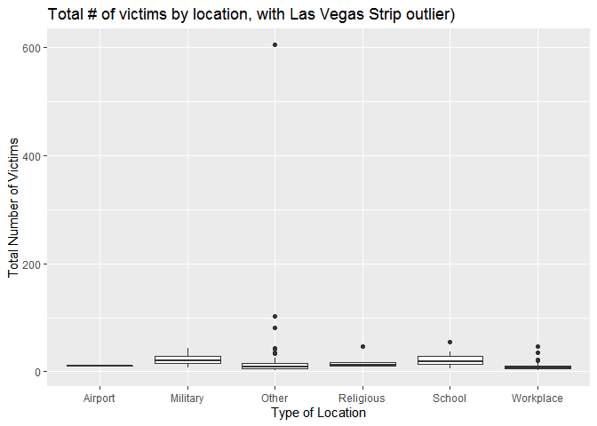
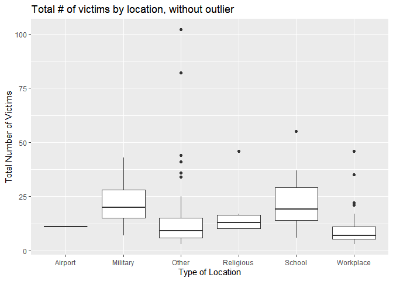
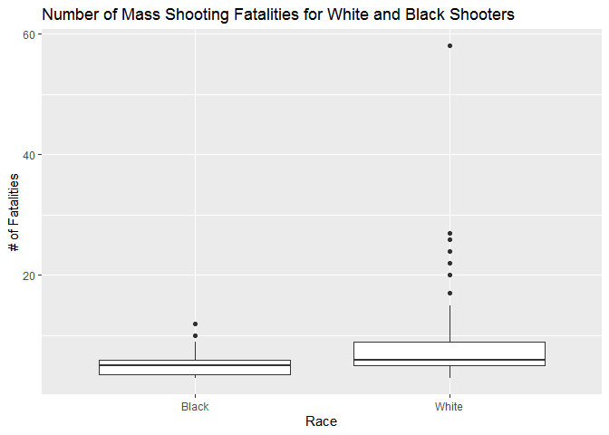
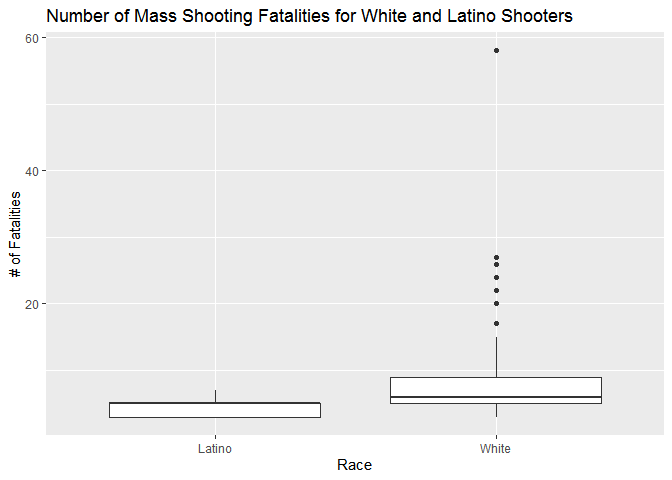
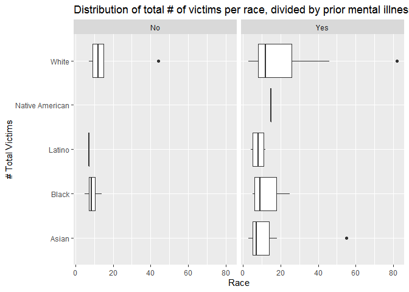

Exploring Mass Shootings in America
================
Benjamin Soltoff

## Get the data

``` r
library(tidyverse)    # load tidyverse packages, including ggplot2
```

    ## -- Attaching packages ---------------------------------------------------------- tidyverse 1.3.0 --

    ## v ggplot2 3.3.2     v purrr   0.3.4
    ## v tibble  3.0.3     v dplyr   1.0.2
    ## v tidyr   1.1.2     v stringr 1.4.0
    ## v readr   1.3.1     v forcats 0.5.0

    ## -- Conflicts ------------------------------------------------------------- tidyverse_conflicts() --
    ## x dplyr::filter() masks stats::filter()
    ## x dplyr::lag()    masks stats::lag()

``` r
library(knitr)        # load functions for formatting tables

# get data from rcfss package
# install latest version if not already installed
devtools::install_github("uc-cfss/rcfss")
```

    ## WARNING: Rtools is required to build R packages, but is not currently installed.
    ## 
    ## Please download and install Rtools 4.0 from https://cran.r-project.org/bin/windows/Rtools/.

    ## Skipping install of 'rcfss' from a github remote, the SHA1 (96a53aff) has not changed since last install.
    ##   Use `force = TRUE` to force installation

``` r
library(rcfss)

# load the data
data("mass_shootings")
mass_shootings
```

    ## # A tibble: 114 x 14
    ##    case   year month   day location summary fatalities injured total_victims
    ##    <chr> <dbl> <chr> <int> <chr>    <chr>        <dbl>   <dbl>         <dbl>
    ##  1 Dayt~  2019 Aug       4 Dayton,~ "PENDI~          9      27            36
    ##  2 El P~  2019 Aug       3 El Paso~ "PENDI~         20      26            46
    ##  3 Gilr~  2019 Jul      28 Gilroy,~ "Santi~          3      12            15
    ##  4 Virg~  2019 May      31 Virgini~ "DeWay~         12       4            16
    ##  5 Harr~  2019 Feb      15 Aurora,~ "Gary ~          5       6            11
    ##  6 Penn~  2019 Jan      24 State C~ "Jorda~          3       1             4
    ##  7 SunT~  2019 Jan      23 Sebring~ "Zephe~          5       0             5
    ##  8 Merc~  2018 Nov      19 Chicago~ "Juan ~          3       0             3
    ##  9 Thou~  2018 Nov       7 Thousan~ "Ian D~         12      22            34
    ## 10 Tree~  2018 Oct      27 Pittsbu~ "Rober~         11       6            17
    ## # ... with 104 more rows, and 5 more variables: location_type <chr>,
    ## #   male <lgl>, age_of_shooter <dbl>, race <chr>, prior_mental_illness <chr>

## Generate a data frame that summarizes the number of mass shootings per year. Print the data frame as a formatted `kable()` table.

``` r
case_by_year <- count(mass_shootings, year)
kable(case_by_year, col.names = c("Year", "# of Shootings"))
```

| Year | \# of Shootings |
| ---: | --------------: |
| 1982 |               1 |
| 1984 |               2 |
| 1986 |               1 |
| 1987 |               1 |
| 1988 |               1 |
| 1989 |               2 |
| 1990 |               1 |
| 1991 |               3 |
| 1992 |               2 |
| 1993 |               4 |
| 1994 |               1 |
| 1995 |               1 |
| 1996 |               1 |
| 1997 |               2 |
| 1998 |               3 |
| 1999 |               5 |
| 2000 |               1 |
| 2001 |               1 |
| 2003 |               1 |
| 2004 |               1 |
| 2005 |               2 |
| 2006 |               3 |
| 2007 |               4 |
| 2008 |               3 |
| 2009 |               4 |
| 2010 |               1 |
| 2011 |               3 |
| 2012 |               7 |
| 2013 |               5 |
| 2014 |               4 |
| 2015 |               7 |
| 2016 |               6 |
| 2017 |              11 |
| 2018 |              12 |
| 2019 |               7 |

## Generate a bar chart that identifies the number of mass shooters associated with each race category. The bars should be sorted from highest to lowest.

``` r
ggplot(mass_shootings, aes(x = fct_infreq(race))) +
  geom_bar() +
  labs(
    title = "Number of Mass Shooters per Race",
    x = "Race",
    y = "Number of Mass Shooters"
    )
```

<!-- -->

## Generate a boxplot visualizing the number of total victims, by type of location. Redraw the same plot, but remove the Las Vegas Strip massacre from the dataset.

``` r
ggplot(mass_shootings, aes(x = location_type, y = total_victims)) +
  geom_boxplot() +
  labs(
    title = "Total # of victims by location, with Las Vegas Strip outlier)",
    x = "Type of Location",
    y = "Total Number of Victims"
  )
```

<!-- -->

``` r
shootings_noLVS <- filter(mass_shootings, location != "Las Vegas, NV")
ggplot(shootings_noLVS, aes(x = location_type, y = total_victims)) +
  geom_boxplot() +
  labs(
    title = "Total # of victims by location, without outlier",
    x = "Type of Location",
    y = "Total Number of Victims"
  )
```

<!-- -->

## How many white males with prior signs of mental illness initiated a mass shooting after 2000?

``` r
mass_shootings %>%
  filter(male == TRUE, prior_mental_illness == 'Yes', race == "White", year > 2000) %>%
  count()
```

    ## # A tibble: 1 x 1
    ##       n
    ##   <int>
    ## 1    20

There were 20 white males with prior signs of mental illnes who
initiated a mass shooting after 2000.

## Which month of the year has the most mass shootings? Generate a bar chart sorted in chronological order to provide evidence of your answer.

``` r
month_levels <- c(
  "Jan", "Feb", "Mar", "Apr", "May", "Jun", "Jul", "Aug", "Sep",
  "Oct", "Nov", "Dec"
)

mass_shootings %>%
mutate(month = factor(month, levels = month_levels)) %>%
  ggplot(aes(x = month)) +
  geom_bar() +
  labs(
    title = "# of Mass Shootings per Month of the Year",
    x = "Month",
    y = "Number of Mass Shootings"
  )
```

<!-- -->

The months of the year with the most mass shootings are February and
June.

## How does the distribution of mass shooting fatalities differ between white and black shooters? What about white and latino shooters?

``` r
mass_shootings %>%
  filter(race == "White" | race == "Black") %>%
  ggplot(aes(x = race, y = fatalities)) +
  geom_boxplot() +
  labs(
    title = "Number of Mass Shooting Fatalities for White and Black Shooters",
    x = "Race",
    y = "# of Fatalities"
  )
```

<!-- -->

``` r
mass_shootings %>%
  filter(race == "White" | race == "Latino") %>%
  ggplot(aes(x = race, y = fatalities)) +
  geom_boxplot() +
  labs(
    title = "Number of Mass Shooting Fatalities for White and Latino Shooters",
    x = "Race",
    y = "# of Fatalities"
  )
```

<!-- -->

The spread of fatalities caused by White shooters is much bigger than
the spread caused by Black and Latino shooters.

## Are mass shootings with shooters suffering from mental illness different from mass shootings with no signs of mental illness in the shooter? Assess the relationship between mental illness and total victims, mental illness and race, and the intersection of all three variables.

``` r
mass_shootings %>%
  filter(!is.na(prior_mental_illness)) %>%
  ggplot(aes(x = prior_mental_illness, y = total_victims)) +
  geom_boxplot() +
  labs(
    title = "Number of Total Victims if Prior Mental Illness",
    x = "Prior Mental Illness?",
    y = "# of Total Victims"
  )
```

<!-- -->

``` r
mass_shootings %>%
  filter(!is.na(prior_mental_illness), !is.na(race)) %>%
  ggplot(aes(x = race)) +
  geom_bar() +
  facet_grid(~prior_mental_illness) +
  coord_flip() +
  labs(
    title = "# Mass shooting incidents per race, divided by prior mental illness",
    x = "# of Mass Shooting Incidents",
    y = "Race"
  )
```

<!-- -->

``` r
mass_shootings %>%
  filter(!is.na(prior_mental_illness), !is.na(race)) %>%
  ggplot(aes(x = race, y = total_victims)) +
  geom_boxplot() +
  facet_grid(~prior_mental_illness) +
  coord_flip() +
  labs(
    title = "Distribution of total # of victims per race, divided by prior mental illness",
    x = "# Total Victims",
    y = "Race"
  )
```

<!-- -->

The first graph, a box plot, shows that the shootings in which the
perpetrator had prior mental illness had a higher number and a higher
spread of total victims. The second graph, a bar chart, counted the
shooting cases per race in which the perpetrator had prior mental
illness, then the cases per race without prior mental illness. For all
races, the number of shootings after a prior history of mental illness
was perceptibly higher. For white perpetrators, the difference is even
more noticeable. The third graph, another box plot, shows that the
number of total victims is higher when there is history of prior mental
illness for all races. Again, the difference is more noticeable among
white perpetrators.

## Session info

``` r
devtools::session_info()
```

    ## - Session info ---------------------------------------------------------------
    ##  setting  value                       
    ##  version  R version 4.0.2 (2020-06-22)
    ##  os       Windows 8.1 x64             
    ##  system   x86_64, mingw32             
    ##  ui       RTerm                       
    ##  language (EN)                        
    ##  collate  English_United States.1252  
    ##  ctype    English_United States.1252  
    ##  tz       America/Chicago             
    ##  date     2020-10-12                  
    ## 
    ## - Packages -------------------------------------------------------------------
    ##  package     * version date       lib source                        
    ##  assertthat    0.2.1   2019-03-21 [1] CRAN (R 4.0.2)                
    ##  backports     1.1.10  2020-09-15 [1] CRAN (R 4.0.2)                
    ##  blob          1.2.1   2020-01-20 [1] CRAN (R 4.0.2)                
    ##  broom         0.7.0   2020-07-09 [1] CRAN (R 4.0.2)                
    ##  callr         3.4.4   2020-09-07 [1] CRAN (R 4.0.2)                
    ##  cellranger    1.1.0   2016-07-27 [1] CRAN (R 4.0.2)                
    ##  cli           2.0.2   2020-02-28 [1] CRAN (R 4.0.2)                
    ##  colorspace    1.4-1   2019-03-18 [1] CRAN (R 4.0.2)                
    ##  crayon        1.3.4   2017-09-16 [1] CRAN (R 4.0.2)                
    ##  curl          4.3     2019-12-02 [1] CRAN (R 4.0.2)                
    ##  DBI           1.1.0   2019-12-15 [1] CRAN (R 4.0.2)                
    ##  dbplyr        1.4.4   2020-05-27 [1] CRAN (R 4.0.2)                
    ##  desc          1.2.0   2018-05-01 [1] CRAN (R 4.0.2)                
    ##  devtools      2.3.2   2020-09-18 [1] CRAN (R 4.0.2)                
    ##  digest        0.6.25  2020-02-23 [1] CRAN (R 4.0.2)                
    ##  dplyr       * 1.0.2   2020-08-18 [1] CRAN (R 4.0.2)                
    ##  ellipsis      0.3.1   2020-05-15 [1] CRAN (R 4.0.2)                
    ##  evaluate      0.14    2019-05-28 [1] CRAN (R 4.0.2)                
    ##  fansi         0.4.1   2020-01-08 [1] CRAN (R 4.0.2)                
    ##  farver        2.0.3   2020-01-16 [1] CRAN (R 4.0.2)                
    ##  forcats     * 0.5.0   2020-03-01 [1] CRAN (R 4.0.2)                
    ##  fs            1.5.0   2020-07-31 [1] CRAN (R 4.0.2)                
    ##  generics      0.0.2   2018-11-29 [1] CRAN (R 4.0.2)                
    ##  ggplot2     * 3.3.2   2020-06-19 [1] CRAN (R 4.0.2)                
    ##  glue          1.4.2   2020-08-27 [1] CRAN (R 4.0.2)                
    ##  gtable        0.3.0   2019-03-25 [1] CRAN (R 4.0.2)                
    ##  haven         2.3.1   2020-06-01 [1] CRAN (R 4.0.2)                
    ##  highr         0.8     2019-03-20 [1] CRAN (R 4.0.2)                
    ##  hms           0.5.3   2020-01-08 [1] CRAN (R 4.0.2)                
    ##  htmltools     0.5.0   2020-06-16 [1] CRAN (R 4.0.2)                
    ##  httr          1.4.2   2020-07-20 [1] CRAN (R 4.0.2)                
    ##  jsonlite      1.7.1   2020-09-07 [1] CRAN (R 4.0.2)                
    ##  knitr       * 1.30    2020-09-22 [1] CRAN (R 4.0.2)                
    ##  labeling      0.3     2014-08-23 [1] CRAN (R 4.0.0)                
    ##  lifecycle     0.2.0   2020-03-06 [1] CRAN (R 4.0.2)                
    ##  lubridate     1.7.9   2020-06-08 [1] CRAN (R 4.0.2)                
    ##  magrittr      1.5     2014-11-22 [1] CRAN (R 4.0.2)                
    ##  memoise       1.1.0   2017-04-21 [1] CRAN (R 4.0.2)                
    ##  modelr        0.1.8   2020-05-19 [1] CRAN (R 4.0.2)                
    ##  munsell       0.5.0   2018-06-12 [1] CRAN (R 4.0.2)                
    ##  pillar        1.4.6   2020-07-10 [1] CRAN (R 4.0.2)                
    ##  pkgbuild      1.1.0   2020-07-13 [1] CRAN (R 4.0.2)                
    ##  pkgconfig     2.0.3   2019-09-22 [1] CRAN (R 4.0.2)                
    ##  pkgload       1.1.0   2020-05-29 [1] CRAN (R 4.0.2)                
    ##  prettyunits   1.1.1   2020-01-24 [1] CRAN (R 4.0.2)                
    ##  processx      3.4.4   2020-09-03 [1] CRAN (R 4.0.2)                
    ##  ps            1.3.4   2020-08-11 [1] CRAN (R 4.0.2)                
    ##  purrr       * 0.3.4   2020-04-17 [1] CRAN (R 4.0.2)                
    ##  R6            2.4.1   2019-11-12 [1] CRAN (R 4.0.2)                
    ##  rcfss       * 0.2.0   2020-10-09 [1] Github (uc-cfss/rcfss@96a53af)
    ##  Rcpp          1.0.5   2020-07-06 [1] CRAN (R 4.0.2)                
    ##  readr       * 1.3.1   2018-12-21 [1] CRAN (R 4.0.2)                
    ##  readxl        1.3.1   2019-03-13 [1] CRAN (R 4.0.2)                
    ##  remotes       2.2.0   2020-07-21 [1] CRAN (R 4.0.2)                
    ##  reprex        0.3.0   2019-05-16 [1] CRAN (R 4.0.2)                
    ##  rlang         0.4.7   2020-07-09 [1] CRAN (R 4.0.2)                
    ##  rmarkdown     2.4     2020-09-30 [1] CRAN (R 4.0.2)                
    ##  rprojroot     1.3-2   2018-01-03 [1] CRAN (R 4.0.2)                
    ##  rstudioapi    0.11    2020-02-07 [1] CRAN (R 4.0.2)                
    ##  rvest         0.3.6   2020-07-25 [1] CRAN (R 4.0.2)                
    ##  scales        1.1.1   2020-05-11 [1] CRAN (R 4.0.2)                
    ##  sessioninfo   1.1.1   2018-11-05 [1] CRAN (R 4.0.2)                
    ##  stringi       1.5.3   2020-09-09 [1] CRAN (R 4.0.2)                
    ##  stringr     * 1.4.0   2019-02-10 [1] CRAN (R 4.0.2)                
    ##  testthat      2.3.2   2020-03-02 [1] CRAN (R 4.0.2)                
    ##  tibble      * 3.0.3   2020-07-10 [1] CRAN (R 4.0.2)                
    ##  tidyr       * 1.1.2   2020-08-27 [1] CRAN (R 4.0.2)                
    ##  tidyselect    1.1.0   2020-05-11 [1] CRAN (R 4.0.2)                
    ##  tidyverse   * 1.3.0   2019-11-21 [1] CRAN (R 4.0.2)                
    ##  usethis       1.6.3   2020-09-17 [1] CRAN (R 4.0.2)                
    ##  utf8          1.1.4   2018-05-24 [1] CRAN (R 4.0.2)                
    ##  vctrs         0.3.4   2020-08-29 [1] CRAN (R 4.0.2)                
    ##  withr         2.3.0   2020-09-22 [1] CRAN (R 4.0.2)                
    ##  xfun          0.17    2020-09-09 [1] CRAN (R 4.0.2)                
    ##  xml2          1.3.2   2020-04-23 [1] CRAN (R 4.0.2)                
    ##  yaml          2.2.1   2020-02-01 [1] CRAN (R 4.0.2)                
    ## 
    ## [1] C:/Users/Gustavo/OneDrive - The University of Chicago/Documents/R/win-library/4.0
    ## [2] C:/Program Files/R/R-4.0.2/library
